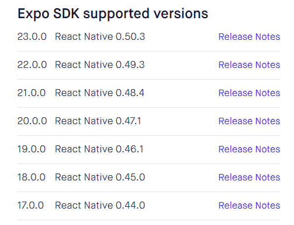

#### 通过react-native-cli来创建及运行项目（命令行cli方式）

不要按照QuickStart中配置，按照`Build Project with Native Code`里面的说明来配置环境，使用QuickStart中没有成功，使用`Build Project with Native Code`成功了

```shell
# 安装cli
npm install -g react-native-cli
# 创建工程
react-native init AwesomeProject
# 运行
cd AwesomeProject
react-native run-android
```


#### 通过Expo的xde来创建及运行项目

1. [安装xde](https://docs.expo.io/versions/latest/introduction/installation.html)

2. 启动android模拟器

3. 通过xde创建新项目

4. 修改项目根路径下的`package.json`文件，expo sdk和react-native的版本对应关系，如下图所示的对应关系

   

   修改expo自动生成的`package.json`文件，保持和上面版本的对应关系，下面是expo自动生成的json文件，需要对应修改有注释的地方

   ```json
   {
     "main": "node_modules/expo/AppEntry.js",
     "private": true,
     "scripts": {
       "test": "node ./node_modules/jest/bin/jest.js --watch"
     },
     "jest": {
       "preset": "jest-expo"
     },
     "dependencies": {
       "@expo/samples": "2.1.1",
       "expo": "^23.0.0",  //步骤1.这里需要修改为"23.0.0"
       "react": "16.0.0",
       "react-native": "https://github.com/expo/react-native/archive/sdk-23.0.0.tar.gz",   //步骤2.这里需要修改为："0.50.3"，和上面保持一致
       "react-navigation": "^1.0.0-beta.19"
     },
     "devDependencies": {
       "jest-expo": "^23.0.0"
     }
   }
   ```

5. 通过expo运行程序

   ​


#### Expo运行React Native问题汇总

1. Expo运行React Native报错

> 错误信息： Couldn't start project on Android: Error running adb: Error running app. Error: Activity not started, unable to resolve Intent { act=android.intent.action.VIEW dat=exp://localhost:19000 flg=0x10000000 }

解决方法：需要提前在模拟器中安装`expo`客户端，然后再次运行程序即可，googleplay上的expo有可能是旧的apk，在expo运行的时候会提示upgrade，点击升级即可

2. There was an unhandled error: 23.0.0 is not a valid SDK version. Options are 18.0.0, 17.0.0, 16.0.0, 15.0.0, 14.0.0, 13.0.0, 12.0.0, 11.0.0, UNVERSIONED

   按照官网的Quick Start新建的项目，在expo中运行，出现了以上错误。

   原因：expo sdk 版本和react native 的版本不一致导致

   解决步骤：

   1. 查看本机安装的react-native的版本

   ```shell
   npm view react-native version
   ```

   2. 修改expo sdk和react native的版本对应关系，参照上图的sdk对应关系设置即可